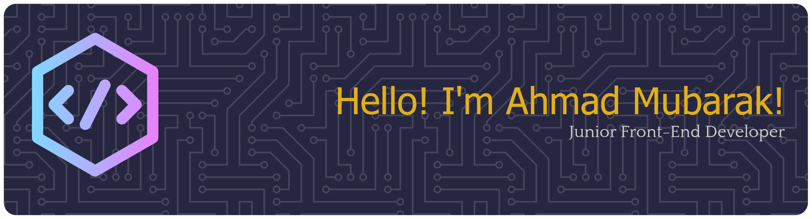

# Welcome to my profile! 

I'm a Computer Science graduate from UIN Sumatera Utara with a focus on front-end web development.

I enjoy building responsive, modern, and user-friendly websites with clean and organized code. I'm continuously improving my skills through personal projects and hands-on practice.

### 🚀 About Me

- 🎓 Computer Science graduate
- 💻 Focused on **Front-End Web Development**
- 🌱 Currently improving my **advanced JavaScript** skills
- 🛠️ Building projects to strengthen my development skills
- 📍 Based in Medan, North Sumatera, Indonesia

 

### 🧰 Tech Stack

Languanges & Framework

    

Tools & Other

   

 

### 🌱 Currently Learning

I'm currently focusing on strengthening my advanced JavaScript and improving my ability to build responsive and interactive web interfaces.

Topics I'm practicing:

- Advanced JavaScript
- API
- Modern JavaScript
- Clean and maintainable code
- Planning to learn ReactJS

### 📊 My Stats

### 🤝 Let's Connect

I'm open to opportunities related to Front-End Web Development and other entry-level technology roles.

  

 Thanks for visiting my profile! 🚀 
